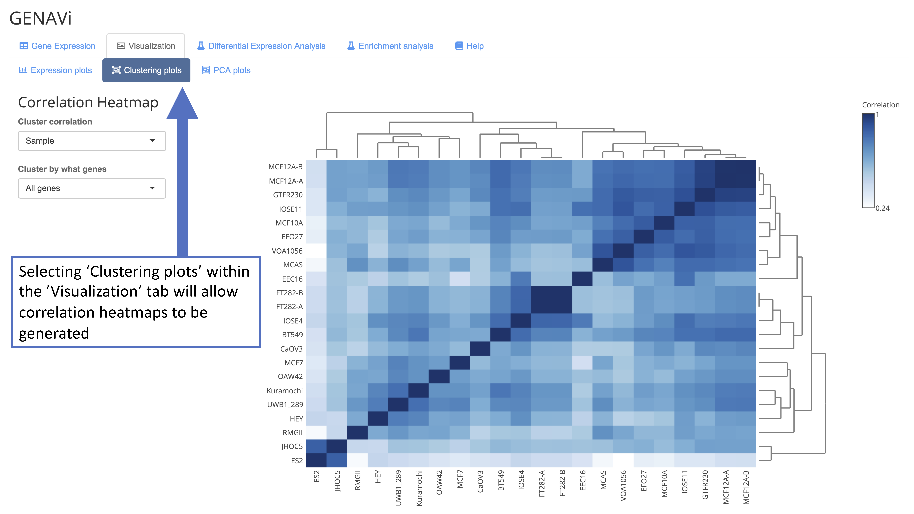
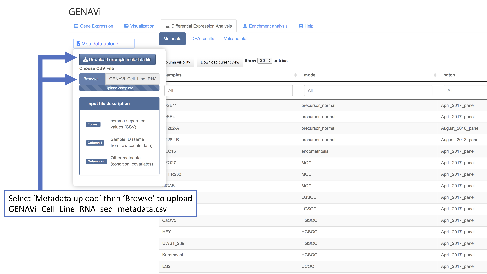
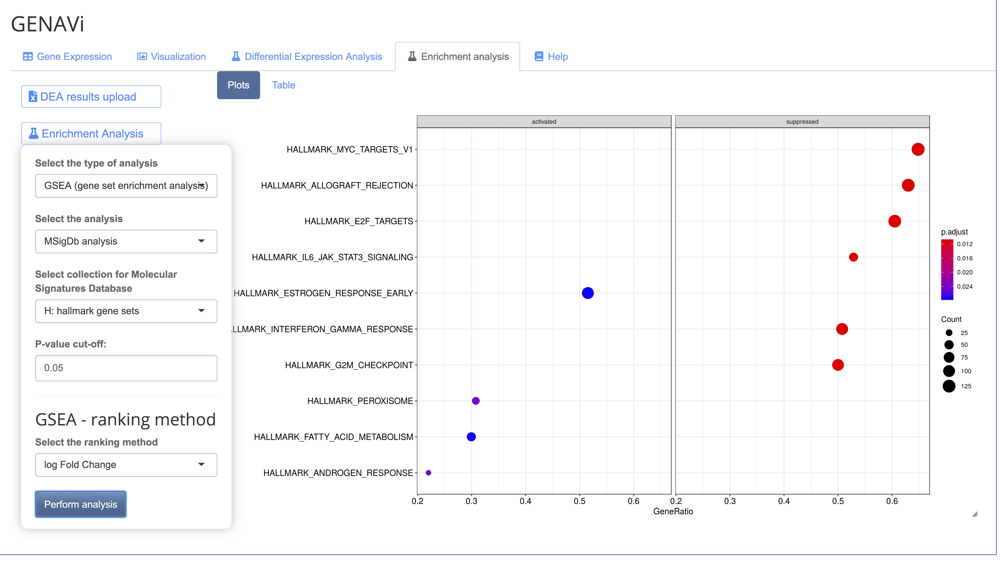

This quick-start tutorial will guide you through using the provided data files to recreate a normalization, plotting and differential expression analysis.  

1.	A set of example files for use with this tutorial can be found at;
https://drive.google.com/drive/folders/1FocRZ6x05_0TwC_xiSIYwhsj9KAYNZwZ?usp=sharing

2.	Download and save the following files;
GENAVi_Cell_Line_RNA_seq_count_matrix.csv
GENAVi_Cell_Line_RNA_seq_metadata.csv
GENAV_gene_list_input.txt

3.	Open junkdnalab.shinyapps.io/GENAVi/

4.	Select the ‘Browse’ button on the ‘Gene Expression’ tab of the app.  

  

5.	Select the ‘Visualization’ tab, and then the ‘Clustering Plots’ sub tab. Figure 3 from the Vignette will be created, showing the clustering of all samples by all genes shown in the data table.  

  

6.	To plot single genes as bar charts select the appropriate normalization method (a detailed explaination of which normalization method is suited to different datatypes is available in the Vignette). Variance stabilization transformation is optimal for most datasets for this purpose. Search and select the gene of interest in the data table. Once selected move to the ‘Visualization’ tab, and the ‘Expression plots’ sub-tab.  

  

  

7.	To perform DEA select the Differential Expression Analysis tab. Select the Browser button to upload the metadata, which will be displayed in the app. 

  

8.	The settings for the DEA can then be selected. The column headers from the metadata file will be listed under the condition and covariate menus for selection. In this example select model as the condition and batch as the covariate to perform DEA between different ovarian cancer subtypes correcting for sequencing batch.  

  

9.	The DEA results are displayed in the main pane. A full description of each column in the table is available in the Vignette.  

  

10.	A volcano plot can be generated with customized parameters for fold change and P value thresholds. Select the checkbox next to Perform Log fold change shrinkage, a log2FoldChange threshold of 1.5 and a P adjusted cut off of 0.01 for this example, which recreates Figure 4 from the Vignette.  

  

11.	The results of DEA can be downloaded using the ‘Download DEA Results’ button. These can easily be used to generate gene lists (example of a gene list is in the Google Drive folder and called GENAV_gene_list_input.txt to select differentially expressed genes to include in cluster, expression or bar plots (such as Figure 2 in the Vignette). 

12. You can use the DEA results as a input for an  enrichment analysis of gene expression data with regard to functional gene sets and pathways. For more information, please read this workshop material https://guangchuangyu.github.io/pathway-analysis-workshop/.  A video demonstrating this part of the tools is available at https://youtu.be/gyfp45lmcV0.

Among the options, GENAVi offers: 

  - gene set enrichment analysis (GSEA) (Subramanian et al. 2005)  
  - Over Representation Analysis (ORA) (Boyle et al. 2004). 

For GSEA, multiple ranking methods are provided: 

  * ranked by $logFC$ 
  * $-log10(Pvalue)/sig(logFC)$ 
  * $-log10(Pvalue) * logFC$. 

Among the analysis, GENAVi provides: 

  * WikiPathways analysis
  * MSigDb analysis
  * Gene Ontology Analysis 
  * KEGG Analysis. 

  
