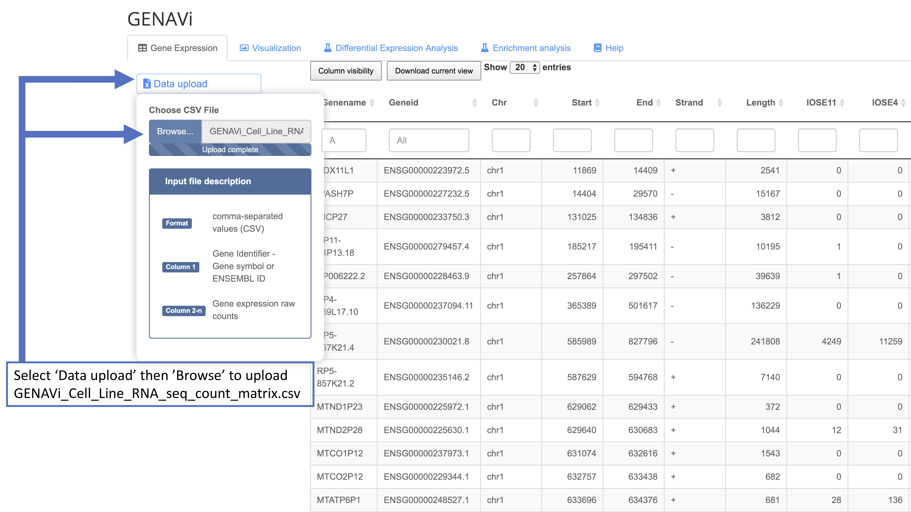
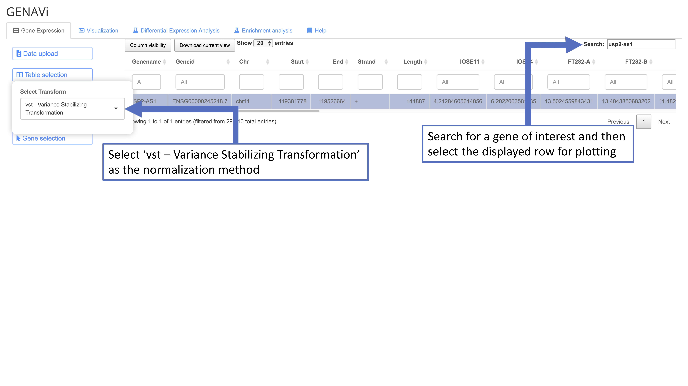
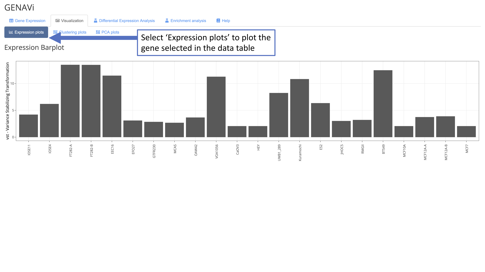
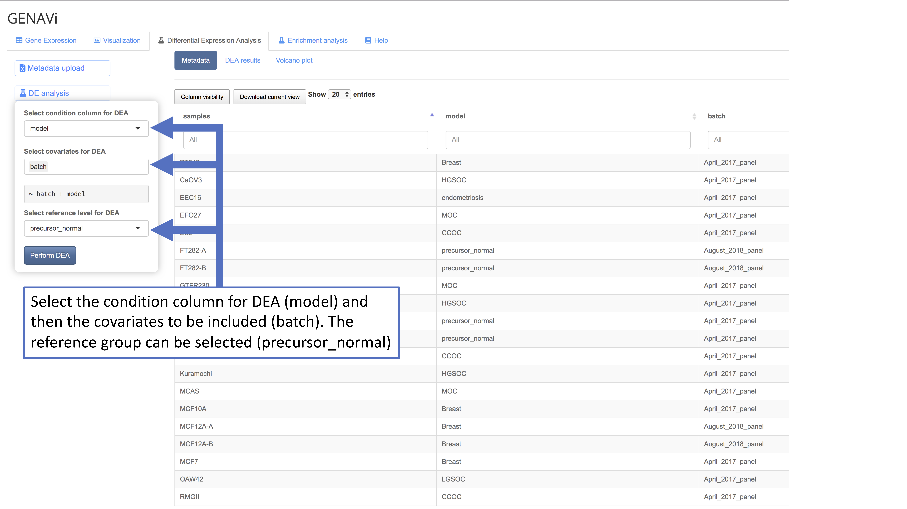

This quick-start tutorial will guide you through using the provided data files to recreate a normalization, plotting and differential expression analysis.  

1.	A set of example files for use with this tutorial can be found at;
https://drive.google.com/drive/folders/1FocRZ6x05_0TwC_xiSIYwhsj9KAYNZwZ?usp=sharing

2.	Download and save the following files:

* GENAVi_Cell_Line_RNA_seq_count_matrix.csv
* GENAVi_Cell_Line_RNA_seq_metadata.csv
* GENAVi_gene_list_input.txt

3.	Open [junkdnalab.shinyapps.io/GENAVi/](junkdnalab.shinyapps.io/GENAVi/)

4.	In the ‘Gene Expression’ tab of GENAVi, select the ‘Data upload’ button to bring up a separate menu then select the ‘Browse’ button to upload your count matrix.

{width=1000px}  

5.	Select the ‘Visualization’ tab, and then the ‘Clustering Plots’ sub tab. By default, Figure 3 from the Vignette will be created, showing the clustering of all samples by all genes shown in the data table.

{width=1000px}  

6. To plot the expression of individual genes as bar charts select the appropriate normalization method (a detailed explanation of which normalization method is suited to different data types is available in the Vignette). Variance stabilization transformation is optimal for most datasets for this purpose. Search and select the gene of interest in the data table. Once selected move to the ‘Visualization’ tab, and the ‘Expression plots’ sub-tab.

{width=1000px}  

{width=1000px}  

7.	To perform DEA select the ‘Differential Expression Analysis’ tab. Select ‘Metadata upload’ to bring up a separate menu then select the ‘Browse’ button to upload the metadata file, which will be displayed in the app.

{width=1000px}  

8.	The settings for DEA can then be set by selecting the ‘DE analysis’ button which will bring up  separate menu. The column headers of the metadata file will be listed under the ‘condition’ and ‘covariate’ menus for selection. In this example select ‘model’ as the condition and ‘batch’ as the covariate to perform DEA between different ovarian cancer subtypes correcting for sequencing batch.

{width=1000px}  

9.	The DEA results are displayed in the main pane. A full description of each column in the table is available in the Vignette.

{width=1000px}

10.	A volcano plot can be generated with customized parameters for fold change and P value thresholds. First, we recommend performing log fold change shrinkage on the DEA results by clicking the ‘Select Results’ button then selecting the checkbox next to ‘Perform Log fold change shrinkage’. To recreate Figure 4 from the Vignette, select the ‘Volcano plot’ button to bring up a separate menu then set a log2FoldChange threshold of 1.5 and a P adjusted cut off of 0.01.

{width=1000px}

{width=1000px}  
11.	The results of DEA can be downloaded through the pop up menu that appears after clicking the ‘Select Results’ button then selecting the ‘Download DEA Results’ button. These can easily be used to generate gene lists. An example gene list labeled GENAVi_gene_list_input.txt  is in the Google Drive folder and can be used to select differentially expressed genes to include in clustering or expression plots (such as Figure 2 in the Vignette).

12. You can use the DEA results as input for an enrichment analysis of gene expression data with regard to functional gene sets and pathways. For more information, please read this workshop material [https://guangchuangyu.github.io/pathway-analysis-workshop/](https://guangchuangyu.github.io/pathway-analysis-workshop/). A video demonstrating this part of the tools is available at [https://youtu.be/EJowR5ScARE](https://youtu.be/EJowR5ScARE).

Among the options, GENAVi offers: 

  - gene set enrichment analysis (GSEA) (Subramanian et al. 2005)  
  - Over Representation Analysis (ORA) (Boyle et al. 2004). 

For GSEA, multiple ranking methods are provided: 

  * ranked by $logFC$ 
  * $-log10(Pvalue)/sig(logFC)$ 
  * $-log10(Pvalue) * logFC$. 

Among the analysis, GENAVi provides: 

  * WikiPathways analysis
  * MSigDb analysis
  * Gene Ontology Analysis 
  * KEGG Analysis. 

{width=1000px}

13. To obtain the code used to perform analysis and generate plots in GENAVi, select the ‘Generate report’ button in any tab to download an html file outlining the analysis performed in that section. 

